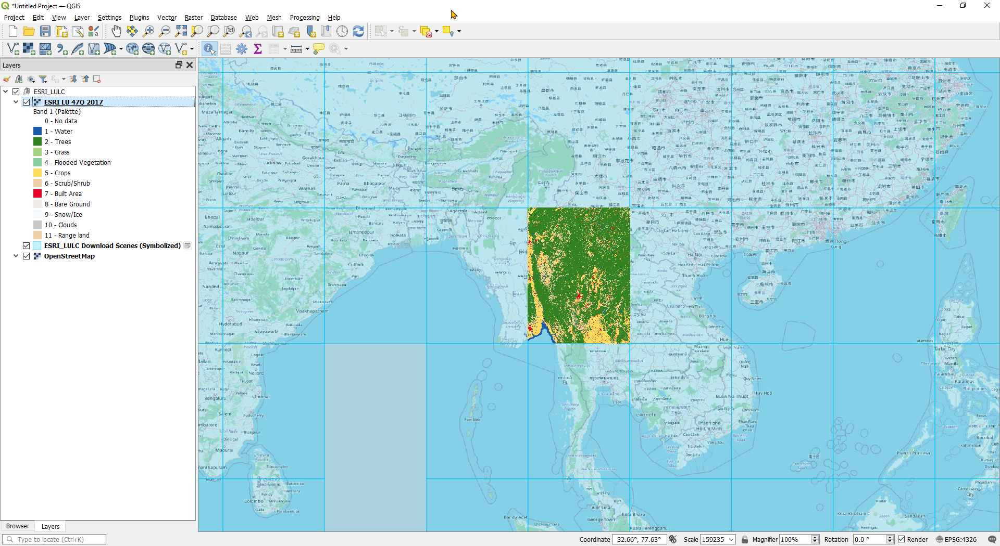
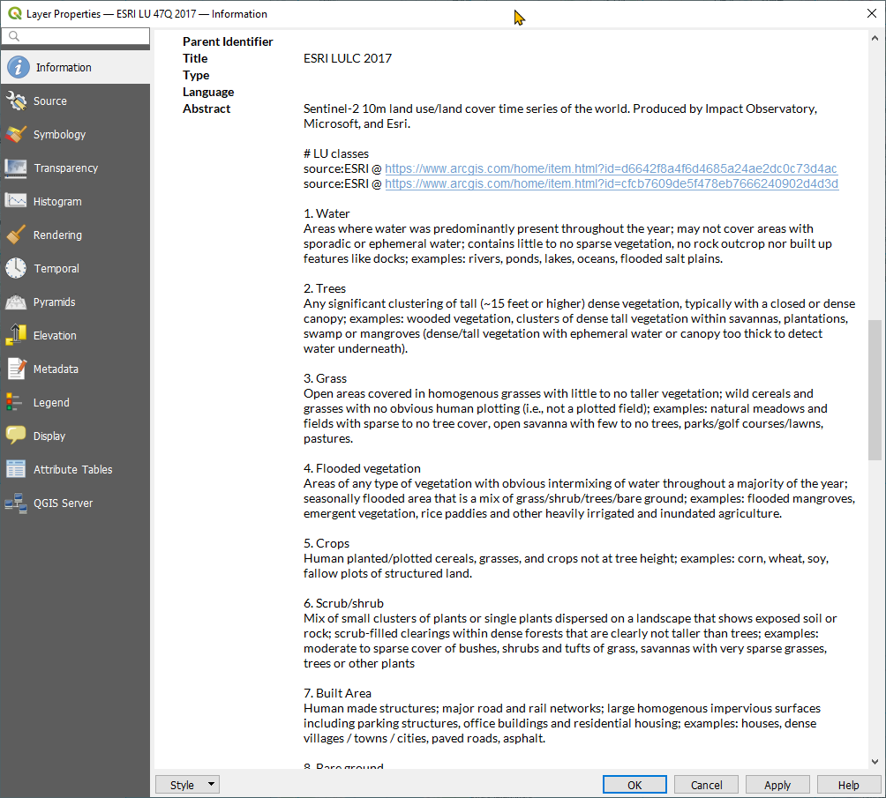

# ESRI Landuse Landcover dataset များကို QGIS တွင်ဒေါင်းခြင်း
 
Impact Observatory, Microsoft နှင့် ESRI တို့ပူးပေါင်းပြီး Machine Learning နည်းပညာဖြင့် Sentinel 2 ပုံများမှ ခွဲခြမ်းစိတ်ဖြာထုတ်လုပ်ထားသော မြေဖုံးလွှမ်းမှုပြ (Landuse Landcover) ပုံများ ကို ထုတ်လုပ်ပေးထားရာ ၂၀၁၇ မှ စတင်ပြီး ၂၀၂၂ (ယခု မတ်လ ၂၀၂၃ အထိသိရသမျှ) အထိရနိုင်ပါသည်။ ထိုပုံများသည် ယခင်က ESRI imagery layer အဖြစ်သာရှိနေသဖြင့် ArcGIS အသုံးမပြုသူများ အလွယ်တကူ အသုံးပြုနိုင်ခြင်းမရှိခဲ့ပါ။ နောက်ပိုင်းတွင် Amazon cloud server ပေါ်တွင် cloud optimized geotif (COG) များအဖြစ်တင်ပေးထားခဲ့ပါသည်။ COG များကို UTM zone နှင့် UTM latitude band အမည်များဖြင့် အမည်ပေးထားပါသည်။ အကြမ်းဖြင်းအားဖြင့် လောင်ဂျီကျု အကျယ် ၆ ဒီဂရီ နှင့် လတ္တီကျုအကျယ် ၈ ဒီဂရီ အရွယ်အစားပုံများဖြစ်ကြသည်။ ArcGIS အသုံးမပြုသူများ လည်း အလွယ်တကူ ရယူအသုံးပြုလာနိုင်သည့်အနေအထားဖြစ်လာပါသည်။

ESRI မှ ၂၀၂၀ နှစ်အတွက် ထို ဂရစ်အကွက်များပါ feature layer တစ်ခုကို ၎င်းတို့၏ platform တွင်မျှဝေပေးခဲ့ပါသည်။ 
https://services.arcgis.com/P3ePLMYs2RVChkJx/arcgis/rest/services/LULC_2020_Download_Scenes/FeatureServer/0

Abdul Raheem Siddiqui ဆိုသူမှ ယင်း ကို QGIS တွင် ဖြင့် မိမိလိုချင်သော နေရာကို မောက်စ် ဖြင့် ကလစ်ပြီး ဒေါင်းလုပ် လုပ်နိုင်ပုံကို တစ်ခုတွင်ရေးသားခဲ့ပါသည်။

https://ar-siddiqui.medium.com/visualize-download-and-use-esri-10m-global-land-use-dataset-in-qgis-using-qgis-actions-and-cogs-71667c623311

နောက်ပိုင်းတွင် အခြား ESRI layer များမှတဆင့် ယင်းဒေတာအစုများ အကြောင်းပိုမိုသိရှိလားပြီး COG data များရှိရာ amazon service တစ်ခုကိုတွေ့ရှိခဲ့ရာ
Siddiqui ၏ Layer action script ကို ထပ်မံ ပြင်ဆင်ပြီး အောက်ပါ အချက်များ ဖြည့်စွက်ခဲ့ပါသည်။

 - ၁. နှစ်တစ်ခုခြင်းစီအတွက် layer action script များ
 - ၂. raster symbology ကို မူလ symbology color များ အတိုင်းဖြစ်စေခြင်း နှင့် 
 - ၃. lu class အမည်များကို ပါ legend lable တွင်ဖော်ပြပေးခြင်း
 - ၄. layer metadata တွင် class lable များအကြောင်းအကျယ်းချုပ်ဖော်ပြချက်ထည့်သွင်းခြင်း

Layer action script ပါပြီးသား ESRI LU grid နှင့် OSM basemap ပါ layer definition ဖိုင် (qlr) ကို ဖန်တီးထားပါသည်။ ယင်းကို ပြီး QGIS တွင်ဖွင့်ပါ။

 - ၁. ESRI LULC Download Scense (Symbolized) layer ကို ရွေးထားပါ
 - ၂. Identify tool ကို ယူပါ

 - ၃. အလိုရှိရာ grid ကွက်ပေါ်တွင် right click ထောက်ပါ မီနူးတစ်ခုပေါ်လာမည်။ 

 - ၄. ရလိုသည့် နှစ် ကို ရွေးပါ။ ခဏစောင့်ပါ COG file ကျလာမည်။

 - ၅. ယင်း COG layer ကို GeoTif သို့မဟုတ် Layer Definition File (qlr) အဖြစ် export လုပ်နိုင်ပါသည်။ သို့မဟုတ် projectfile အဖြစ်သိမ်းပါ။

Kyaw Naing Win

၁၃ ဧပြီ ၂၀၂၃

သင်္ကြန်အကြိုနေ့
