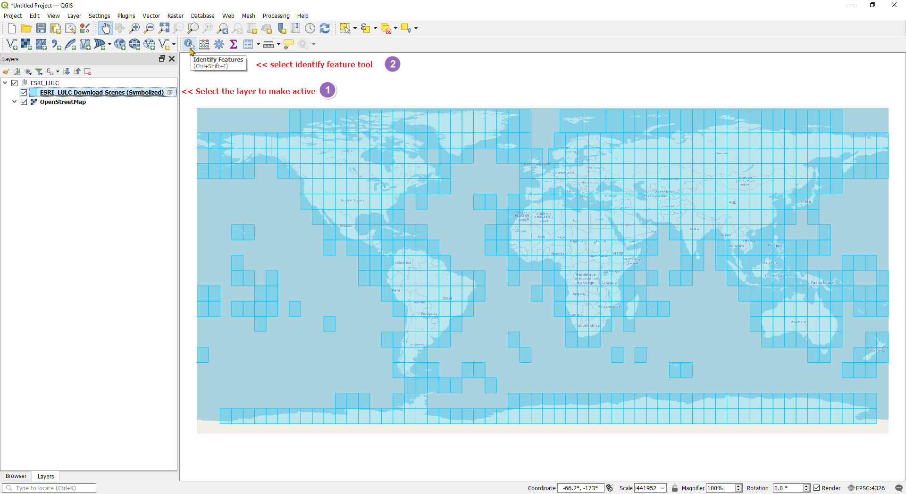
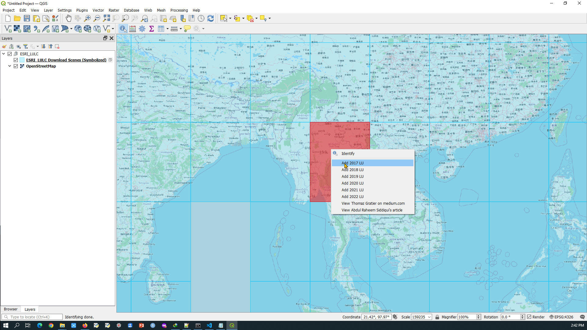
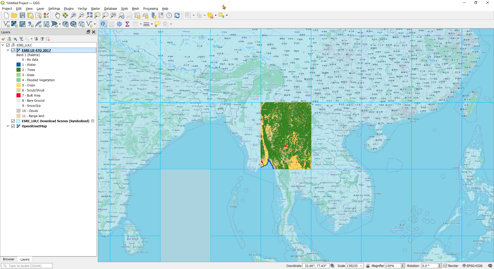
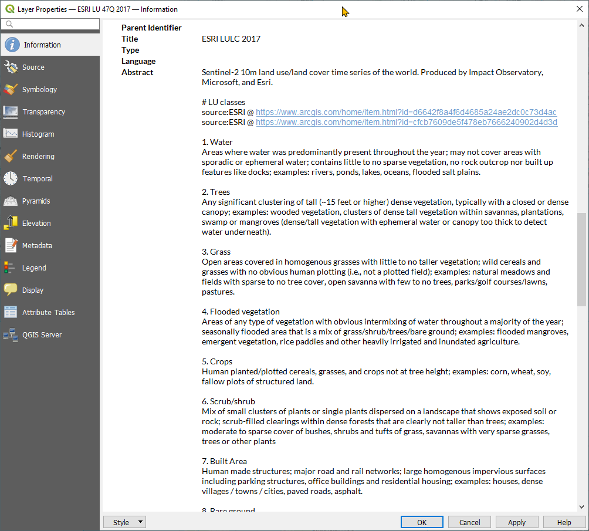

# Downloading Global Landuse Landcover dataset of Your Area of Interest in QGIS

Impact Observatory, Microsoft and ESRI have collaborated to produce Global landcover datasets from Sentinel 2 imagery using machine learning classification model. I saw such dataset as ESRI's living atlas dataset but not much interested as it was an ESRI's imagery layer that QGIS users cannot use much. Later I found that these datasets were available on Amazon cloud service as cloud optimized geotif dataset. These COG dataset were named according to UTM zones and latitude bands။ Generally these are 6 deg x 8 deg size datasets.Being in COG format, they are easy to download via QGIS.

ESRI has published a   for 2020 Landcover dataset

Abdul Raheem Siddiqui published a  last year. In the article he mentioned how these landcover dataset can be downloaded using QGIS layer action. But it was for just 2020 Landcover only

Later I found some articles about this LU datasets and learned that the datasets since 2017 are available on https://lulctimeseries.blob.core.windows.net ( I think it is on amazon cloud). So I modify Siddiqui's script to include following..
Siddiqui ၏ Layer action script ကို ထပ်မံ ပြင်ဆင်ပြီး အောက်ပါ အချက်များ ဖြည့်စွက်ခဲ့ပါသည်။

 - 1 Layer action scripts for each year
 - 2 Symbolize the layer same as orignal style publised by ESRI
 - 3 Add class lables along with class id in the legend
 - 4 Add class lable descriptioins in the metadata abstract

I created a Layer definition file (qlr) which includes ESRI LU grid (feature layer) and OSM basemap (for easy reference) and open in QGIS. Do following steps

 - 1 Make ESRI LULC Download Scense (Symbolized) layer active
 - 2 Select Identify tool

 - 3 On desired grid, right click and popup menu will appear 

 - 4 Select year of your interes. COG file will be streamed shortly.

 - 6 You can export the COG layer as GeoTif or Layer Definition File (qlr)။ Otherwise you can save them in a project file.

----
Kyaw Naing Win

13 Apr 2023
