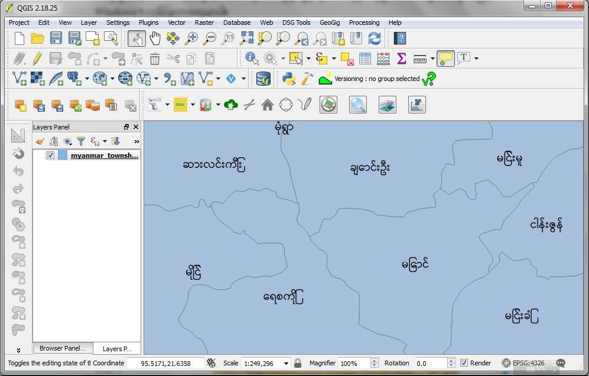

# GIS တွင် မြန်မာ font coversion လုပ်ခြင်း #

ကျနော်တို့ မှာ ဝင်း ဇော်ဂျီ ယူနီကုတ် (Win, Zawgyi, Unicode )ဆိုပြီး အခြေခံ ဖောင့်သုံးမျိုးရှိပါတယ်။ GIS Attribute table ထဲမှာ လည်း ဒေတာတွေကို ယင်း ဖောင့် တစ်ခုမဟုတ်တစ်ခုသုံးပြီး ထည့်ထားမျိုးတွေရှိပါတယ်။ အထူးသဖြင့် မြို့ရွာ အမည်တွေနေရာမှာပါ။

 

အသုံးများတဲ့ ArcGIS 10.x နဲ့ QGIS 2.x မှာ ဇော်ဂျီနဲ့ ယူနီကုတ် က မှန်ကန်စွာ မပေါ်ပါဘူး။ အထူးသဖြင့် Windows 7 ကွန်ပြူတာတွေမှာပါ။

 

QGIS 3.x မှာ တော့ ဇော်ဂျီနဲ့ယူနီကုတ်စနစ် ကို ထောက်ပံ့ထားတဲ့ အတွက် မြေပုံပေါ်မှာ ယင်းဖောင့်များနဲ့ စာထိုးရင်မှန်ကန်စွာပေါ်ပါတယ်။ ယင်းဖောင့် နှစ်ခု ရဲ့အားနည်းချက်က စာလုံးပုံစံအခွဲ Font styles (လူလိုဆိုရင် လက်ရေးလက်သား ပုံစံကွဲတွေ) မရှိတဲ့အတွက် မြန်မာစာနဲ့ မြေပုံထုတ်လုပ်ရေး အပိုင်းမှာ အမြဲတမ်း ဒီ ဖောင့် ပုံစံတစ်တည်း သုံးနေရတဲ့အတွက် Cartography အပိုင်းမှာ အားနည်းပါတယ်။ 

အောက်ပုံကတော့ ယူနီကုတ်နဲ့ ထိုးထားပုံ။ စာတွေမှန်ပေမယ့် ဆွဲဆောင်မှုနည်းတဲ့ ပုံတုံးကြီး :D

label with unicode font in QGIS 3.4

 

Win font တွေက ခုအချိန်မှာ စာစီစာရိုက်တွေမှာ အသုံးနည်း သွားပြီဖြစ်ပေမယ့် သူက စာလုံးပုံစံအခွဲများစွာရှိခဲ့ပါတယ်။ ဥပမာ Win Innwa, Win Researcher, Win Avva etc ။ အထက်က ဇော်ဂျီနဲ့ယူနီကုတ် ရဲ့ GIS application မှာကြုံနေရတဲ့ ဖောင့်ပုံစံရှားပါးမှု ကို Win font တွေက တစ်စိတ်တဒေသ ဖြေရှင်းပေးနိုင်ပါတယ်။ တစ်ချိန်တည်းမှာပဲ ခေတ်စနစ်ပြောင်းလဲလာမှုအရ Attribute table ထဲမှာ Win ဖောင့် အစား ယူနီကုတ်ကို ပဲ သုံးစွဲဖို့ လိုအပ်လာပါတယ်။ ဒီဖောင့်တွေကို အခြင်းခြင်း အပြန်အလှန်ပြောင်းပေးတဲ့ stand alone software နဲ့ browser base application တွေ ရှိပါတယ်။ ဥပမာ Rabbit converter။ Font ပြောင်းခြင်ရင်စာပိုဒ်လိုက် ကော်ပီကူးပြီး သူတို့ ထဲထည့်ပြီး ပြောင်း ရတာမျိုးပါ။

 

တစ်ဖက်မှာလည်း မြေပုံခေါင်းစဉ်ကို Win နဲ့ ရိုက်ရတာ အခက်အခဲမရှိပေမယ့် attribute table ထဲက Zawgyi သို့မဟုတ် Unicode နဲ့ထည့်ထားတဲ့ အချက်အလက်တွေကို Win font ပြောင်းဖို့ သို့မဟုတ် Win ကနေ Unicode ပြောင်းဖို့ (ကောက်လံအသစ်မှာ ဖြစ်ဖြစ်) အထက်က converter တွေနဲ့ ပြောင်းဖို့ရာ အခက်အခဲရှိပါတယ်။ တစ်ခုခြင်း ကောက်ပီကူး အပြင်က converter ထဲမှာ font ပြောင်းပြီး ကော်လံအသစ်ထဲထည့် ပြန်ထည့်ဖို့ရာ ဒေတာပေါင်း ထောင်သောင်းရှိလာရင် အခက်အခဲရှိလာပါတယ်။ ဥပမာ ကျေးရွာ အမည်တွေ က ခြောက်သောင်းကျော်ရှိပါတယ်။

 

အထက်က conveter တွေအပြင် programming libraries တွေရှိတယ်ဆိုတာ နောက်ပိုင်းမှာသတိထား မိလာပါတယ်။ Rabbit converter မှာ programming language မျိုးစုံအတွက် library တွေ ဖန်တီးပေး ထားပါတယ်။ သူက Zawgyi နဲ့ Unicode အကြား ပဲ ပြောင်းပေးတာပါ ။ Win အတွက်မပါ ပါဘူး။ သူ့မှာ python အတွက် ပါပေမယ့် ကိုယ်က python ကို ထဲထဲဝင်ဝင်မသိခဲ့တဲ့အတွက် ဘယ်လိုသုံးရမှန်းမသိခဲ့ဘူး။ ၂၀၁၈ အနှောင်းပိုင်းမှာ python ကို ပိုပြီး လုပ်ဖြစ်လာခဲ့တယ်။ သူ့ကို GIS software တွေတော်တော်များမှာ ထည့်ပေးထားပါတယ်။ Python ကို Database, Data mining, Web, ML, Ai, Image Processing, Visualization, Data science နယ်ပယ်တွေမှာပါသုံးတော့ အဲဒီနယ်ပယ်တွေထဲမှာ လေ့လာချင်င်ရင် language အသစ်ကိုသင်စရာမလိုပဲ ကိုယ်သိထားတဲ့ python နဲ့ ဆက်လေ့လာလို့ရတယ်။ ၂၀၁၉ ထဲ ရောက်တော့ Rabbit converter ရဲ့ python library/module ကိုစမ်းသပ်သုံးလို့ရလာပါတယ်။

အောက်ပုံက တော့ Rabbit converter ပါ။

Rabbit converter: Unicode <> Zawgyi converter

 

ဒီ ၂၀၁၉ မတ်လထဲမှာ python-myanmar module ဆိုတာကို အမှတ်မထင်တွေ့ပါတယ်။ ဒီ module က ဝင်း ဖောင့်၊ ဇော်ဂျီ နဲ့ ယူနီကုတ် ဖောင့်တွေကို အပြန်အလှန်ပြောင်းပေးနိုင်ပါတယ်။ Pandas နဲ့ Geopandas module တွေနဲ့တွဲပြီး geospatial data နဲ့ csv, excel တွေထဲက မြန်မာဖောင့်တွေကို ပြောင်းလို့ရလာပါတယ်။ GIS မှာ ဒီ module ကိုခေါ်သုံးလို့ရရင် attribute ထဲကဒေတာတွေကို font ပြောင်းဖို့ က ပိုလွယ်သွားပါပြီ။ ပြသနာက ဒီ module က python 3.0 ကနေ 3.6 version ထိပဲသုံးလို့ရတော့ python 2.7 သုံးတဲ့ ArcGIS 10.x နဲ့ QGIS 2.x တွေမှာ သုံးလို့မရသလို python 3.7 သုံးတဲ့ မှာ QGIS 3.x မှာလည်း သုံးလို့မရပြန်ဘူး။ (ArcGIS Pro က Python 3.4 သုံးတယ်လို့သိရပါတယ်)

 

python 3.6 နဲ့ သုံးလို့ရနေတော့ သူ့ထက်နည်းနည်းပဲ ပိုမြင့်တဲ့ python 3.7 (QGIS 3.x) မှာ module ကို install လုပ်ကြည့်တော့ ဘာ error မှ မတက်ပဲထည့်လို့ရသွားတယ်။ ဒါပေမယ့် python script တွေ run တော့မှ error တွေတက်ပါတော့တယ်။ အင်တာနက် မှာ အဲဒီ error နဲ့ ပတ်သက်တဲ့ ပိုစ်တွေလိုက်ရှာဖတ်ပြီး အကြံပြုချက်တွေအတိုင်း ထဲက module ထဲက  ဖိုင်တစ်ချို့မှာ ပြင်ကြည့်တော့ အလုပ်ဖြစ်သွားတယ်။ ဒါပေမယ့် ဒီလိုmodule ထဲက python ဖိုင်ထဲ ဝင်ပြင်တာကို ဘယ်လိုပဲ ရှင်းလင်းချက်တွေရေးပေး ထားဦးတော့ အများစု GIS သမားတွေအတွက်ကတော့ အခက်အခဲတစ်ခုဖြစ်နေမှာတွေးမိတယ်။ အဲဒါနဲ့ module ကို ရေးတဲ့ ကိုသူရလှိုင်ကို ဆက်သွယ်ပြီး အကျိုးအကြောင်း အီးမေးနဲ့ ပြောပြတော့ သူက python 3.7 အတွက် module ထပ်လုပ်ပေးပါတယ်။ (ကျနော့်အမည်ကိုတောင် contributor စာရင်းထဲ မှာထည့် ပေးလိုက်သေးတယ် 8-) ။

 

ဒီတော့ QGIS 3.4 မှာ python-myanmar module သုံးပြီး font convert လုပ်လို့ရပါပြီ။ ArcGIS 10.x မှာတိုက်ရိုက် မရပေမယ့် QGIS 3.4 သုံးပြီး attribute က ဒေတာတွေကို font covert လုပ်ပြီး ArcGIS 10.x မှာ ပြန်သုံးလို့ရတော့ အဆင်ပြေမယ်ထင်ပါတယ်။ 

အောက်ပုံမှာ UNICODE ကော်လံထဲက အမည်တွေကို Win font တစ်ခုနဲ့ lable ထိုးပြထားတာပါ

on-the-fly font conversion from Unicode to Win in QGIS 3.4

အောက်ကပုံကတော့ python-myanmar module ကိုသုံးပြီး font conversion functions တွေဖန်တီးထားတာပါ။ ယင်း function တွေသုံးပြီး အပေါ်ကပုံမှာ unicode ကနေ win font ကို on-the-fly conversion လုပ်ပြီး အပေါ်ကပုံမှာ label  ထိုးထားတာပါ။ 

custom font converstion functions created based on Pyton-Myanmar module

 

GIS သမား အများစုအတွက် module install လုပ်နည်း နဲ့ ကျနော် အသင့်ရေးထားတဲ့ custom expression ဖိုင်ကို ဘယ်လိုနေရာချထားပြီး QGIS 3.x ကနေ ဘယ်လိုခေါ်သုံးရမယ်ဆိုတာ ကို ရေးသားပြီးမကြာခင်တင် ပေးမှာ မို့ အချိန် ခဏလောက်သည်းခံစောင့်ဆိုင်းကြပါလို့….

 

-------------------------------------------------

 

March 20, 2019 ; တပေါင်းလပြည့်နေ့
(covert to unicode on Aug 12, 2022)
 

Kyaw Naing Win
